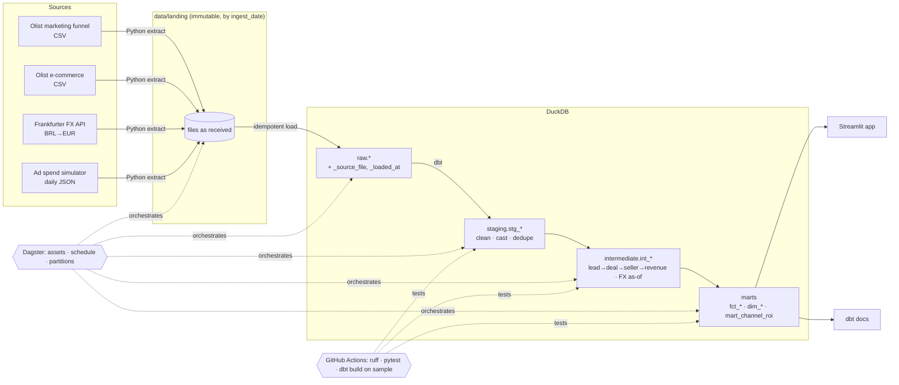

# Architecture

```mermaid
flowchart LR
    subgraph Sources
        K1[Olist marketing funnel<br/>CSV]
        K2[Olist e-commerce<br/>CSV]
        FX[Frankfurter FX API<br/>BRL→EUR]
        SP[Ad spend simulator<br/>daily JSON]
    end
    subgraph Landing["data/landing (immutable, by ingest_date)"]
        L[(files as received)]
    end
    subgraph DuckDB
        R[raw.*<br/>+ _source_file, _loaded_at]
        S[staging.stg_*<br/>clean · cast · dedupe]
        I[intermediate.int_*<br/>lead→deal→seller→revenue · FX as-of]
        M[marts<br/>fct_* · dim_* · mart_channel_roi]
    end
    K1 & K2 & FX & SP -->|Python extract| L -->|idempotent load| R -->|dbt| S --> I --> M
    M --> APP[Streamlit app]
    M --> DOCS[dbt docs]
    ORCH{{Dagster: assets · schedule · partitions}} -.orchestrates.-> L & R & S & I & M
    CI{{GitHub Actions: ruff · pytest · dbt build on sample}} -.tests.-> S & I & M
```
